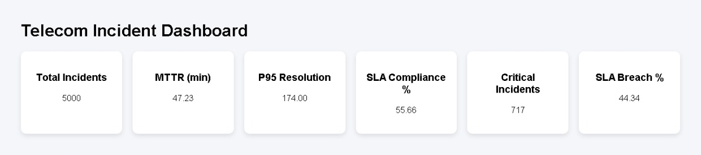
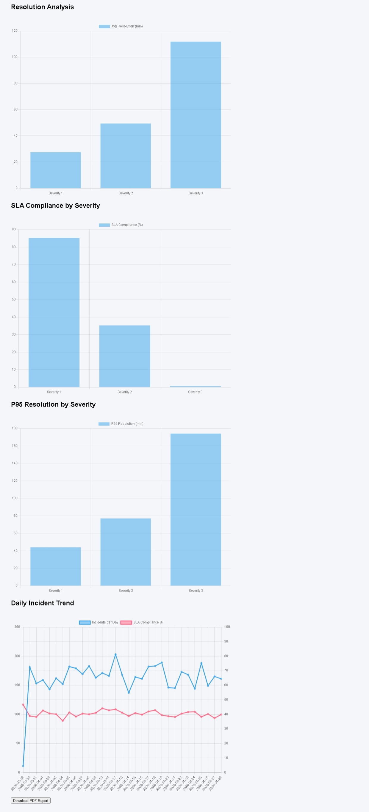
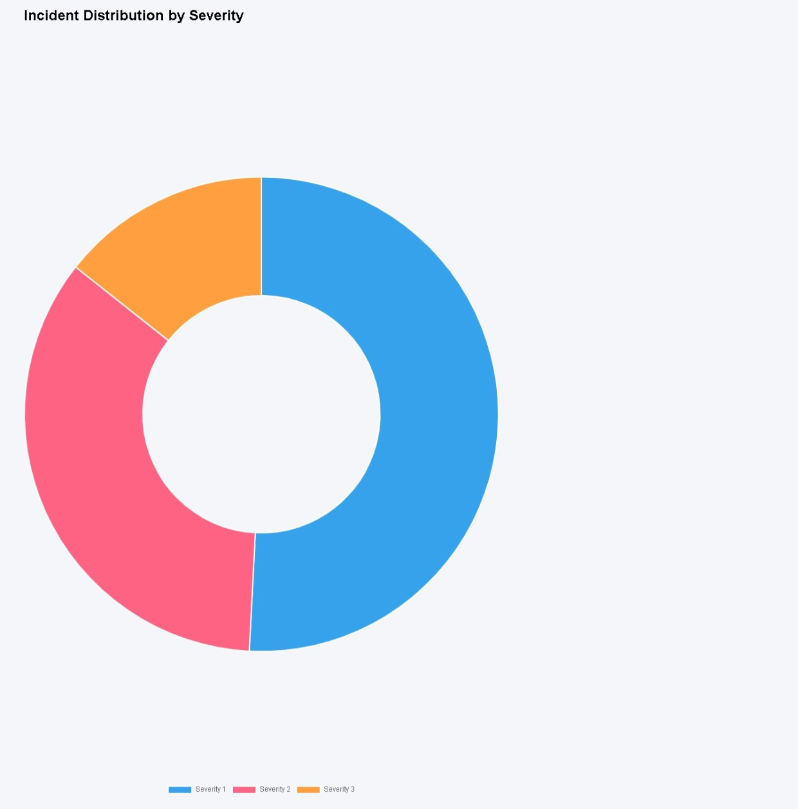

# Telecom Incident Observability Dashboard

End-to-end observability and incident analytics platform built with FastAPI, PostgreSQL, Docker and Chart.js.

## Portfolio Project Focus
SRE • Observability • Incident Analytics • Backend Engineering

## Overview

This project simulates a telecom observability cockpit focused on operational reliability metrics, incident behavior and SLA performance.

It includes:

- Incident analytics API
- Observability dashboard
- Synthetic incident generation (5,000+ records)
- PostgreSQL analytical views
- Dockerized full stack environment
- KPI monitoring for operational performance

---

## Architecture

Tech stack:

- Python
- FastAPI
- PostgreSQL
- SQLAlchemy
- Docker / Docker Compose
- Chart.js
- HTML/CSS/JavaScript

Architecture:

Frontend Dashboard  
↓  
FastAPI REST API  
↓  
Analytics Services  
↓  
PostgreSQL Views / Incident Data

---

## Key Metrics Implemented

### Reliability KPIs
- MTTR (Mean Time To Resolution)
- P95 Resolution Time
- SLA Compliance %
- SLA Breach %
- Critical Incident Distribution

### Severity Analytics
- Resolution time by severity
- SLA compliance by severity
- Incident distribution (Doughnut)
- Daily operational metrics endpoint

---

## Sample Dashboard

### Executive Cockpit


### SLA Monitoring


### Severity Distribution


---

## API Endpoints

Operational metrics:

```http
GET /metrics
GET /metrics?severity=2
GET /metrics/daily
```

Example response:

```json
[
 {
   "severity":1,
   "total_incidents":2516,
   "avg_resolution":27.63,
   "sla_compliance":84.78
 }
]
```

---

## Synthetic Incident Generator

Custom generator creates 5,000 simulated incidents with:

- Weighted severity distribution
- Resolution-time variability
- SLA breaches
- Regional scope simulation
- Telecom incident categories

---

## Run Locally

```bash
docker compose up --build
```

API:
http://localhost:8000

Dashboard:
http://localhost:5500

---

## Project Highlights

Designed to demonstrate:

- Backend API Engineering
- Data Engineering
- Observability Metrics
- Incident Analytics
- Reliability Engineering Concepts
- Monitoring Dashboard Design

---

## Future Improvements

- Predictive incident risk scoring
- NLP incident classification
- Prometheus/Grafana integration
- Real-time streaming metrics
- Anomaly detection

---

## Author

Rodrigo Oliveira  
Computer Engineer | Data/Observability Projects | Applied AI & Analytics